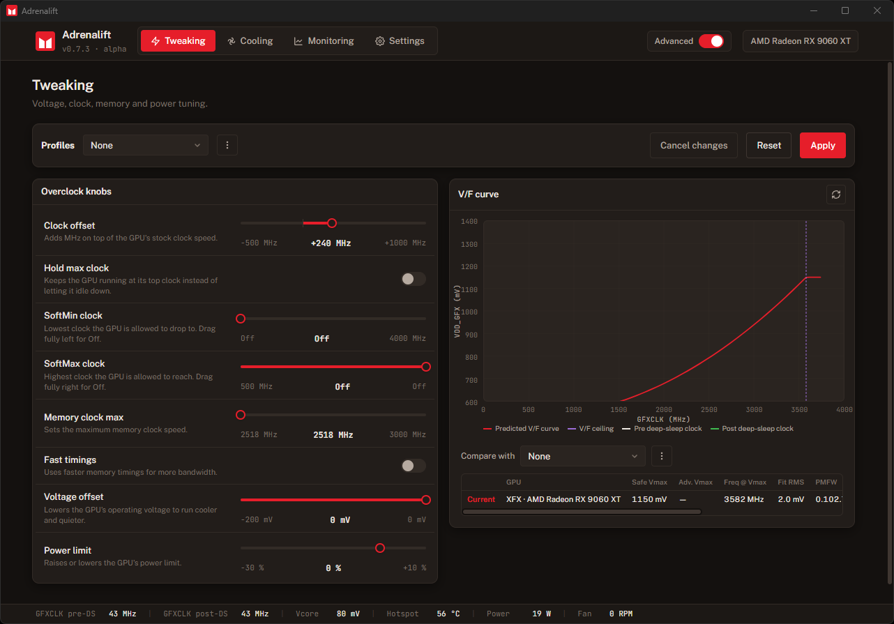

# Adrenalift

A modern overclocking and tuning utility for **AMD Radeon RX 9000 series (RDNA 4)** graphics cards on Windows.

Adrenalift gives you precise, real-time control over your GPU — clocks, voltage, memory, power, cooling and monitoring — in one clean, native app. Every change is applied live and is fully temporary: reboot and your card is back to stock. Nothing is flashed, nothing is permanent.

  

  💬 <a href="https://www.overclock.net/threads/adrenalift-%E2%80%94-unlock-boost-clocks-on-rdna4-windows-pp-table-patcher.1819169">Join the discussion on Overclock.net</a>

---

## Requirements

- **Windows 11** (64-bit)
- An **AMD Radeon RX 9000 series (RDNA 4)** GPU. Adrenalift is built for the RDNA 4 family. RDNA 3 and older are untested and unsupported.
- A current **AMD Adrenalin** driver installed
- **Administrator privileges** — needed to read GPU telemetry and apply settings

> Overclocking is done at your own risk. All changes are non-persistent and revert on reboot, so any unstable setting is undone with a simple restart.

---

## Features

### Tweaking
Dial in your card with a clean, focused set of controls:

- **GPU core clock offset** — add headroom on top of the stock boost clock
- **Undervolting** — lower the operating voltage to run cooler and quieter
- **Memory clock & fast timings** — raise the memory clock and tighten timings for more bandwidth
- **Clock limits** — set a floor and ceiling for how high and low the GPU is allowed to clock *(Advanced mode)*
- **Power limit** — give the card more (or less) power budget
- **Hold max clock** — keep the GPU pinned at its top clock instead of idling down

A live **voltage/frequency curve**, built from a quick on-device calibration, shows exactly how your settings reshape the card's behaviour *before* you commit them. Save your favourite setups as **profiles** and switch between them instantly.

### Cooling
Take full control of your fans:

- A **5-point fan curve** you drag into shape
- A simple **fixed-speed** mode, or the **stock** profile when you want hands-off
- **Zero-RPM** for silent fans at idle

### Monitoring
Keep an eye on everything that matters:

- **Live charts** for clocks, voltages, temperatures, power and more
- A **metric picker** so you plot only what you care about
- **CSV export** for logging and later analysis

### Built-in stress test
Validate your overclock without leaving the app. A built-in GPU load scene pushes the card toward its real power and thermal limits, with **adjustable intensity** and an optional **frame-rate cap** so you can probe behaviour at different operating points.

### Safe & Advanced modes
Adrenalift runs in one of two modes, switchable any time from the top bar.

**Safe mode** *(default)* talks to your GPU through the AMD driver directly, with **no extra kernel drivers loaded**. It's the most compatible option — it sits happily alongside anti-cheat–protected games and won't be flagged by security software. You still get the core controls: clock offset, undervolt, memory, power limit and cooling. The trade-off is that the **richer telemetry** and the **soft clock floor/ceiling limits** aren't available in this mode.

**Advanced mode** loads a small low-level helper driver (InpOut) to reach deeper into the GPU. This unlocks the **full telemetry set** and the **soft clock limits**, which open up more tuning potential. Because it loads a kernel-level driver, **some antivirus or anti-cheat software may flag or block it** — so it's best to keep Advanced mode off while playing anti-cheat–protected games, and you may need to allow the helper driver in your security software. You can switch back to Safe mode at any time.

### Made yours
- Four themes — **Dark**, **Dark Warm**, **Light** and **Paper** — plus accent colours
- **Close-to-tray**, **start minimized**, and **start with Windows**
- Adjustable telemetry polling rate

---

## Credits

Adrenalift stands on the shoulders of the RDNA overclocking community.

- **fpsflow** — for the foundational research on raising RDNA 3 / RDNA 4 desktop-class power, current and voltage limits and adding VID offsets. Adrenalift works best paired with his work. Read his write-up here: [Increasing RDNA3/RDNA4 desktop-class power limits and adding VID offsets](https://www.overclock.net/threads/increasing-rdna3-rdna4-desktop-class-power-limits-and-adding-vid-offsets.1816083).
- **[nik2234](https://www.overclock.net/members/nik2234.648545/)** — for getting me into RDNA 4 and opening the door to the overclocking community, for being the project's voice of reason, and for serving as its main tester. Adrenalift wouldn't be what it is without him.

---

## Support

Adrenalift is built and maintained by a solo developer. If it earned a place in your setup, you can help keep development moving:

☕ **[Buy me a coffee](https://www.buymeacoffee.com/miklebel)** — every contribution genuinely helps and is hugely appreciated.

---

© 2026 Adrenalift. All rights reserved. Adrenalift is closed-source software.
